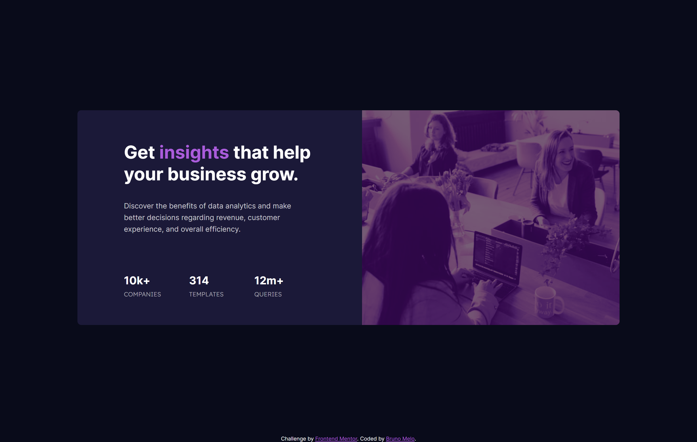

# Frontend Mentor - Stats preview card component solution

This is a solution to the [Stats preview card component challenge on Frontend Mentor](https://www.frontendmentor.io/challenges/stats-preview-card-component-8JqbgoU62). Frontend Mentor challenges help you improve your coding skills by building realistic projects. 

## Table of contents

- [Overview](#overview)
  - [The challenge](#the-challenge)
  - [Screenshot](#screenshot)
- [My process](#my-process)
  - [Built with](#built-with)
  - [What I learned](#what-i-learned)
  - [Continued development](#continued-development)
- [Author](#author)

## Overview

In this challenge I was able to apply some of the things I'm learning in HTML and CSS like keeping the semantic code and the layout flexible.

### The challenge

Users should be able to:

- View the optimal layout depending on their device's screen size

### Screenshot

## My process

I started to separate all the HTML sections that I needed to develop this project, after that I started styling section by section until I got the result most similar to the screen proposed in the challenge.

### Built with

- Semantic HTML5 markup
- CSS custom properties
- Flexbox
- Mobile-first workflow

### What I learned

I learned a lot using flexbox to structure the layout proposed in this challenge.

### Continued development

In upcoming projects I want to focus on better understanding how to build a layout using a canvas submitted by a designer, I mean I intend to better recognize the spacings and sizes used to create that specific canvas. Well, I think that's what I have the most difficulty with.

## Author

- GitHub - [Bruno Melo](https://github.com/BrnMelo)
- Frontend Mentor - [@BrnMelo](https://www.frontendmentor.io/profile/BrnMelo)
